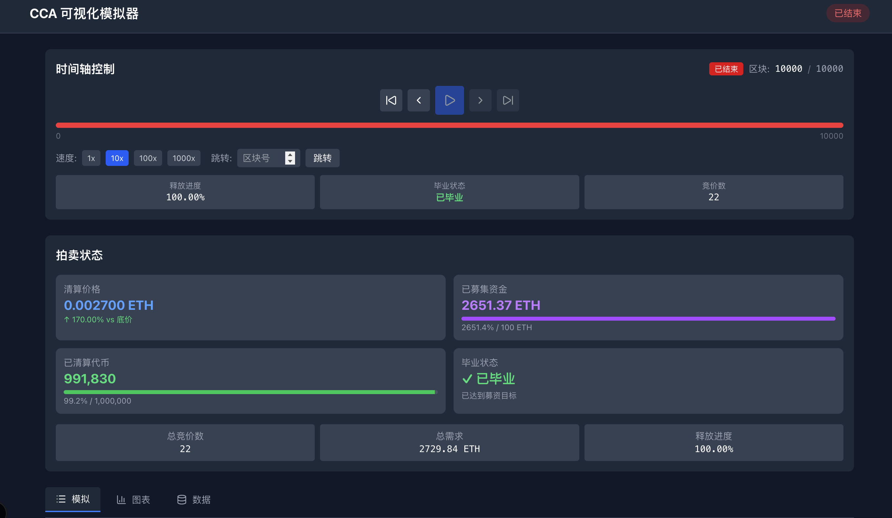

# Continuous Clearing Auction 模拟器


根据https://github.com/Uniswap/continuous-clearing-auction 搭建的纯前端模拟器，可以通过配置各种参数体验cca功能


## preview





## 使用


要求Node.js>=20

```shell
npm i
npm run dev
```


## 问题


随时可以issue


## 后续


希望研究更多关于cca的应用


若有好的想法与实践，欢迎 hrui561@gmail.com，一起探索更多可能